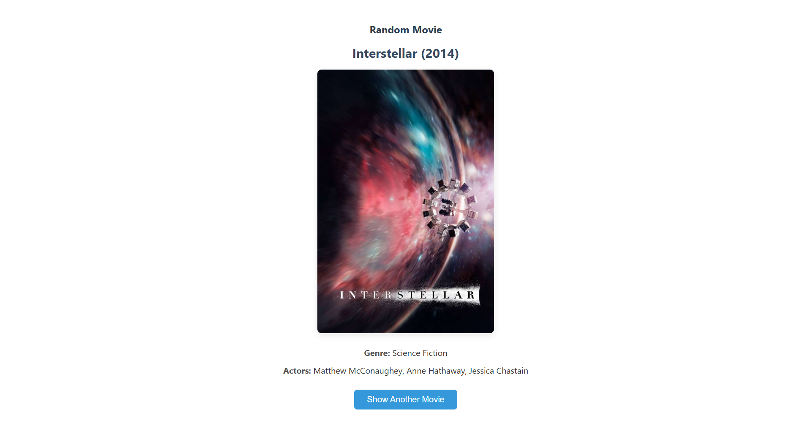

# 🎬 Random Movie App

A simple Java web app that displays a random movie, including its title, poster, genre, year, and cast. The backend is powered by a minimal HTTP server and the frontend is styled with basic HTML and CSS.



---

## 🚀 Quick Start

### 1. Clone and Run

```bash
git clone https://github.com/l4nzel0d/RandomMovieApp.git
cd RandomMovieApp
./gradlew runAppContainer
```

This single command will:

- Build the app
- Create a fat JAR with all dependencies
- Build the Docker image
- Remove any existing container with the same name (if needed)
- Run the app in a new Docker container

The app will be available at:

👉 **http://localhost:8080/**

You should see a random movie with its poster, title, year, genre, and cast.


## 🛑 Stopping the App

```bash
./gradlew stopAppContainer
```


## 🧹 Cleanup (Optional)

To remove the Docker image and container:

```bash
./gradlew cleanDocker
```

## 📚 Generating Javadoc Documentation
You can generate comprehensive API documentation for the project's Java code using Gradle's built-in javadoc task. This creates HTML files that detail your classes, methods, and fields, based on the Javadoc comments in your source code.

To generate the documentation:

```bash
./gradlew javadoc
```
Once the task completes, you'll find the generated HTML documentation in: `build/docs/javadoc/`

You can then open `index.html` within that directory in your web browser to browse the documentation.